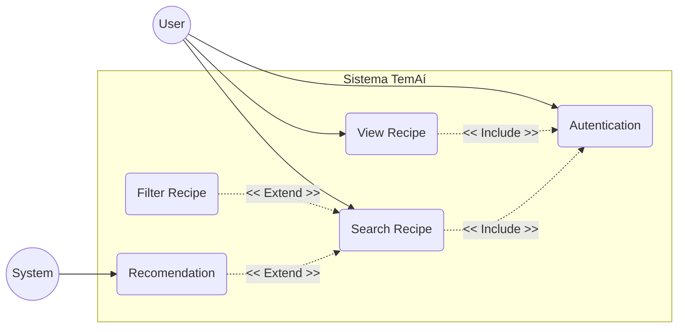
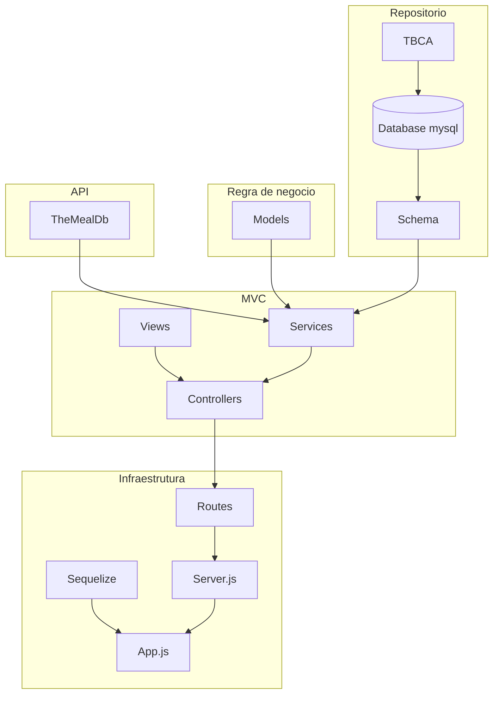

# 🍳 TemAí — Documentação do Sistema

> **Versão:** v1.0.4.2026  
> **Data de Emissão:** 28 de julho de 2026  
> **Local:** Presidente Prudente - SP  

---

## 📌 Sumário
- [1. Escopo do Projeto](#1-escopo-do-projeto)
- [2. Visão Geral do Sistema](#2-visão-geral-do-sistema)
- [3. Matriz de Requisitos Funcionais](#3-matriz-de-requisitos-funcionais)
- [4. Diagrama de Casos de Uso](#4-diagrama-de-casos-de-uso)
- [5. Especificação dos Casos de Uso](#5-especificação-dos-casos-de-uso)
  - [RF-01: Autenticar Usuário](#rf-01-autenticar-usuário)
  - [RF-02: Gerenciamento de Usuário](#rf-02-gerenciamento-de-usuário)
  - [RF-03: Visualizar Receitas](#rf-03-visualizar-receitas)
  - [RF-04: Filtragem de Receitas](#rf-04-filtragem-de-receitas)
  - [RF-05: Lista de Receitas Favoritas](#rf-05-lista-de-receitas-favoritas)
  - [RF-06: Recomendação de Receitas](#rf-06-recomendação-de-receitas)
  - [RF-07: Pesquisar Receitas](#rf-07-pesquisar-receitas)
- [6. Arquitetura do Sistema](#6-arquitetura-do-sistema)

---

## 1. Escopo do Projeto

O **TemAí** é uma solução que visa a construção de um aplicativo mobile com o objetivo de facilitar a escolha de receitas culinárias a partir dos ingredientes que o usuário já possui em casa. 

O projeto contempla a entrega dos seguintes módulos integrados:
* 🌐 **Web API**
* 💻 **Aplicação WEB**
* 📱 **Aplicação Móvel**
* 🗄️ **Banco de Dados**

Os detalhes de implementação técnica de cada módulo orientam o desenvolvimento integral da solução.

---

## 2. Visão Geral do Sistema

O projeto está dividido em módulos entregáveis e integrados. Em um contexto geral, a solução contempla:
* **Autenticação de Usuários:** Acesso seguro e personalizado.
* **Pesquisa e Filtragem de Receitas:** Busca inteligente baseada em ingredientes e tempo de preparo.
* **Visualização Guiada:** Passo a passo detalhado para execução das receitas.
* **Favoritos e Recomendação:** Histórico do usuário e perfil de consumo para recomendações personalizadas.

---

## 3. Matriz de Requisitos Funcionais

| ID | Título | Descrição | Prioridade |
| :--- | :--- | :--- | :---: |
| **RF-01** | Autenticar Usuário | Sistema deve gerenciar o acesso do usuário aos sistemas | **Essencial** |
| **RF-02** | Gerenciamento de Usuário | Sistema deve gerenciar a criação e exclusão de usuários da plataforma | **Essencial** |
| **RF-03** | Visualizar Receitas | O sistema deve exibir as receitas disponíveis seja pelo filtro ou recomendação | **Essencial** |
| **RF-04** | Filtragem de Receitas | O sistema mostrará itens para selecionar e filtrar de acordo | **Essencial** |
| **RF-05** | Lista de Receitas Favoritas | O sistema deve mostrar as receitas favoritadas | **Essencial** |
| **RF-06** | Recomendação de Receitas | O sistema deve utilizar o histórico do usuário para recomendar receitas de acordo com o perfil | **Desejável** |
| **RF-07** | Pesquisar Receitas | O sistema deve apresentar uma barra de pesquisa para pesquisar tanto receitas ou selecionar os filtros de receitas | **Essencial** |

---

## 4. Diagrama de Casos de Uso

---

## 5. Especificação dos Casos de Uso

### 🔑 RF-01: Autenticar Usuário
* **Descrição Resumida:** Controla o acesso do usuário e as funcionalidades do sistema.
* **Atores:** Usuário
* **Pré-condições:** Não há.
* **Fluxo Principal (F-01 – Autenticar):**
  1. O usuário acessa a tela de autenticação.
  2. O usuário insere as credenciais válidas `[E-01]`.
  3. O usuário visualiza o painel principal.
* **Fluxos Alternativos e de Exceção:**
  * **FE-01 (Dados Inválidos):** Se o usuário inserir uma credencial inválida, ele visualiza um feedback de erro: `"Credencial Inválida"`.
* **Dados de Entrada e Saída:**
  * **Entrada `[E-01]`:** E-mail e senha.

---

### 👤 RF-02: Gerenciamento de Usuário
* **Descrição Resumida:** Gerencia o cadastro de usuário, exclusão de usuário, atualização de usuário e listagem de usuário.
* **Atores:** Usuário, Sistema
* **Pré-condições:** Usuário autenticado.
* **Fluxos Principais:**
  * **F-01 – Cadastro de Usuário:**
    1. O usuário acessa a tela de cadastro de usuário.
    2. O sistema exibe o formulário de cadastro de usuário.
    3. O usuário insere os dados de cadastro de usuário `[E-01]`.
    4. O sistema exibe a mensagem de confirmação `"Atendimento criado"`.
  * **F-02 – Exclusão de Atendimento/Usuário:** Processo de remoção do cadastro do usuário no sistema.
* **Fluxos Alternativos e de Exceção:**
  * **FE-01 (Dados Inexistentes ou Incompletos):** Se o sistema não tiver todas as informações do usuário, exibe a mensagem padrão `"Credenciais incompletas ou inválidas"`.
* **Dados de Entrada e Saída:**
  * **Entrada `[E-01]`:** E-mail, senha e nome de usuário.
  * **Saída `[S-01]`:** E-mail, senha e nome de usuário.

---

### 🍳 RF-03: Visualizar Receitas
* **Descrição Resumida:** Exibe os detalhes da receita contando com procedimento, preparação, ingredientes, tempo de preparo, imagem da receita e classificações/etiquetas da receita.
* **Atores:** Usuário, Sistema
* **Pré-condições:** Não há.
* **Fluxo Principal (F-01):**
  1. O sistema lista as informações da receita na ordem: Imagem da receita, classificações/etiquetas da receita, ingredientes, tempo de preparo, preparação e procedimentos com um botão ao final intitulado **"Selecionar"**.
  2. O usuário clica no botão **"Selecionar"** e é encaminhado para uma outra página onde o processo é separado por etapas (Preparação, Procedimento 1 até o Procedimento N). Para avançar entre as etapas é necessário clicar no botão ao final da página intitulado **"Prosseguir"**. Ao final do último procedimento terá um botão **"Finalizar receita"**.
  3. Ao final da receita, o usuário será encaminhado para uma página de avaliação da receita com um sistema de estrelas e um botão para avaliar a receita ou não.
* **Fluxos Alternativos e de Exceção:**
  * **FE-01 (Dados Inexistentes ou Incompletos):** Se o sistema não tiver todas as informações da receita, exibe a mensagem padrão `"Receita incompleta"`.
* **Dados de Entrada e Saída:**
  * **Saída `[S-01]`:** Imagem da receita, classificações/etiquetas da receita, ingredientes, tempo de preparo, preparação e procedimentos.

---

### 🏷️ RF-04: Filtragem de Receitas
* **Descrição Resumida:** A partir das etiquetas das receitas, o sistema elimina as receitas que não possuam as etiquetas selecionadas.
* **Atores:** Sistema
* **Pré-condições:** Usuário autenticado.
* **Fluxo Principal (F-01):**
  1. O sistema mostra uma lista de etiquetas variadas que classificam as receitas, e o usuário seleciona as etiquetas que especificam o tipo de receita almejada.
  2. O sistema elimina da pesquisa dos usuários as receitas que não são congruentes com as selecionadas.
* **Fluxos Alternativos e de Exceção:**
  * **FE-01 (Dados Inexistentes):** Se o sistema não identificar nenhuma receita de acordo com as especificações do usuário, exibe a mensagem padrão `"Receita não encontrada"`.
* **Dados de Entrada e Saída:**
  * **Saída `[S-01]`:** Classificações/etiquetas da receita, ingredientes, tempo de preparo, preparação e procedimentos.
* **Regras de Negócio:**
  * **RN-01 — Receitas e suas Categorizações por Tempo:**
    * **< 30 minutos:** Receitas de curto-prazo
    * **Entre 30 e 60 minutos:** Receitas de médio-prazo
    * **> 60 minutos:** Receitas de longo-prazo

---

### ⭐ RF-05: Lista de Receitas Favoritas
* **Descrição Resumida:** Exibe uma lista das receitas favoritadas.
* **Atores:** Sistema
* **Pré-condições:** Usuário autenticado.
* **Fluxo Principal (F-01):**
  1. O sistema lista as receitas favoritadas pelo usuário em formato de recomendação.
* **Fluxos Alternativos e de Exceção:**
  * **FE-01 (Dados Inexistentes ou Incompletos):** Se o usuário não tiver receitas favoritadas, o sistema exibe a mensagem padrão `"Nenhuma receita favorita"`.
* **Dados de Entrada e Saída:**
  * **Saída `[S-01]`:** Imagem da receita, classificações/etiquetas da receita.

---

### 💡 RF-06: Recomendação de Receitas
* **Descrição Resumida:** Recomenda receitas ao usuário de acordo com suas preferências e receitas favoritadas.
* **Atores:** Sistema
* **Pré-condições:** Usuário autenticado.
* **Fluxo Principal (F-01):**
  1. O sistema obtém as etiquetas das receitas favoritadas.
  2. O sistema guarda o histórico de pesquisa do usuário.
  3. O sistema retorna receitas com etiquetas semelhantes.
* **Fluxos Alternativos e de Exceção:**
  * **FE-01 (Dados Inexistentes ou Incompletos):** Se o usuário não possui histórico de etiquetas pesquisadas ou favoritadas, o sistema exibe a mensagem padrão `"Sem histórico de receitas"`.
* **Dados de Entrada e Saída:**
  * **Saída `[S-01]`:** Imagem da receita, classificações/etiquetas da receita.

---

### 🔍 RF-07: Pesquisar Receitas
* **Descrição Resumida:** Barra de pesquisa e navegação para pesquisar nome de receitas.
* **Atores:** Usuário
* **Pré-condições:** Não há.
* **Fluxo Principal (F-01):**
  1. O usuário utiliza a barra de pesquisa, escrevendo o nome de uma receita específica.
* **Fluxos Alternativos e de Exceção:**
  * **FE-01 (Dados Inexistentes ou Incompletos):** Se a barra de pesquisa não estiver funcionando, o sistema exibe a mensagem padrão `"Barra de pesquisa inativa"`.
* **Dados de Entrada e Saída:**
  * **Entrada `[E-01]`:** Nome da receita || classificações/etiquetas da receita.
  * **Saída `[S-01]`:** Imagem da receita, classificações/etiquetas da receita.

---

## 6. Arquitetura do Sistema

O diagrama arquitetural descreve as camadas e integrações do sistema, abrangendo a **Infraestrutura**, a camada **MVC**, as integrações com **APIs Externas**, as **Regras de Negócio** e a **Camada de Repositório e Banco de Dados**.

### Componentes Chave:
- **Infraestrutura:** Roteamento de endpoints, integração ORM via Sequelize e executores Serverless.
- **MVC:** Divisão clara entre Controllers (orquestração), Views (telas da Aplicação Web/Mobile) e Services (lógica operacional).
- **API Externa:** Integração com o serviço `TheMealDB` para obtenção de receitas globais.
- **Camada de Dados & Persistência:** Banco relacional MySQL, validação de esquemas (`Schemas`) e suporte a requisições com `tRPC`.
